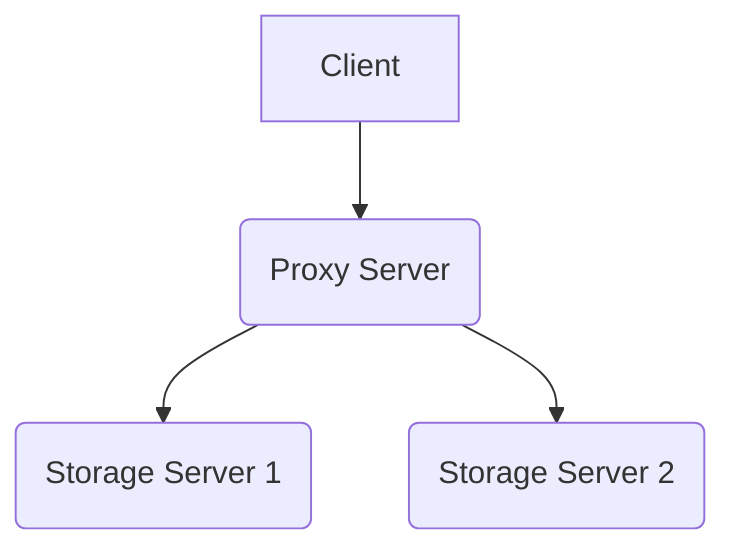

# Deploying XPN with a Proxy Server

This guide explains the steps to establish a connection using SSH tunneling and configure the client, proxy server, and storage servers for an XPN deployment.

In this example setup, we use 4 different machines: the client machine, a proxy server, and two backend storage servers.



### 1. Establish SSH Tunnels for Port Forwarding (if necesary)
First, you need to set up the necessary port tunnels from your local machine to the remote server, in this case (`c3.uc3m.es`).

```bash
# Run in client:

# Tunnel for the control port (3456)
ssh -N -f -L *:3456:localhost:3456 tester005@c3.uc3m.es

# Tunnel for the main comunication for the sck_server port (3457)
ssh -N -f -L *:3457:localhost:3457 tester005@c3.uc3m.es
```


### 2. Client Configuration
This configuration specifies how the client connects to the service, this client run in the local machine where the SSH tunnel was deployed.
If an SSH tunnel is not necessary, you can use the name or IP address of the proxy server instead of localhost.

```ini
[partition]
bsize = 512k
replication_level = 0
partition_name = xpn
server_url = sck_server://localhost/xpn
```

### 3. Proxy Server Configuration
This configuration is used by the proxy server. It defines the backend storage servers that the proxy will manage and forward requests to. Ensure the backend servers are running on the specified nodes, in this case in srv104, srv105 with the mpi_server protocol.

```ini
[partition]
bsize = 512k
replication_level = 0
partition_name = xpn
server_url = mpi_server://srv104/tmp/xpn
server_url = mpi_server://srv105/tmp/xpn
```

### 4. Launch the Storage Servers
The backend storage servers are launched first.
```sh
# Run in storage servers:
mpiexec -n 2 -hosts srv104,srv105 xpn_server --server_type mpi --thread_mode pool
```

### 5. Launch the Proxy Server
The proxy server is launched using the Socket Protocol (sck) to listen for connections from the client (via the SSH tunnel if necesary) and is explicitly marked with the --proxy flag.
```sh
# Run in proxy server:
export XPN_CONF=<path to conf of step 3>
xpn_server --server_type sck --thread_mode pool --port 3456 --comm_port 3457 --proxy
```

### 6. Usage in client
This step shows two ways to use the XPN service from the client.
It is necessary to use ```export XPN_LOCALITY=0``` to disable the use of locality, since a proxy server is being used.

#### A. Using the Bypass Library
The environment variable LD_PRELOAD is used to load a bypass library before any other library when an application starts. This library intercepts standard file system calls (like open, read, write) and redirects them to the XPN proxy server instead of the local file system.
```sh
# Run in client:
export XPN_LOCALITY=0
export XPN_CONF=<path to conf of step 2>
export LD_PRELOAD=<path to bypass library>
./test/integrity/bypass/open-write-close /tmp/expand/xpn/test.txt 10
```

#### B. Using XPN API Directly
This method uses an application compiled to link directly against the XPN library, making explicit XPN calls without relying on the LD_PRELOAD interception.
```sh
# Run in client:
export XPN_LOCALITY=0
export XPN_CONF=<path to conf of step 2>
./test/performance/xpn/open-write-close xpn/test.txt 10
```